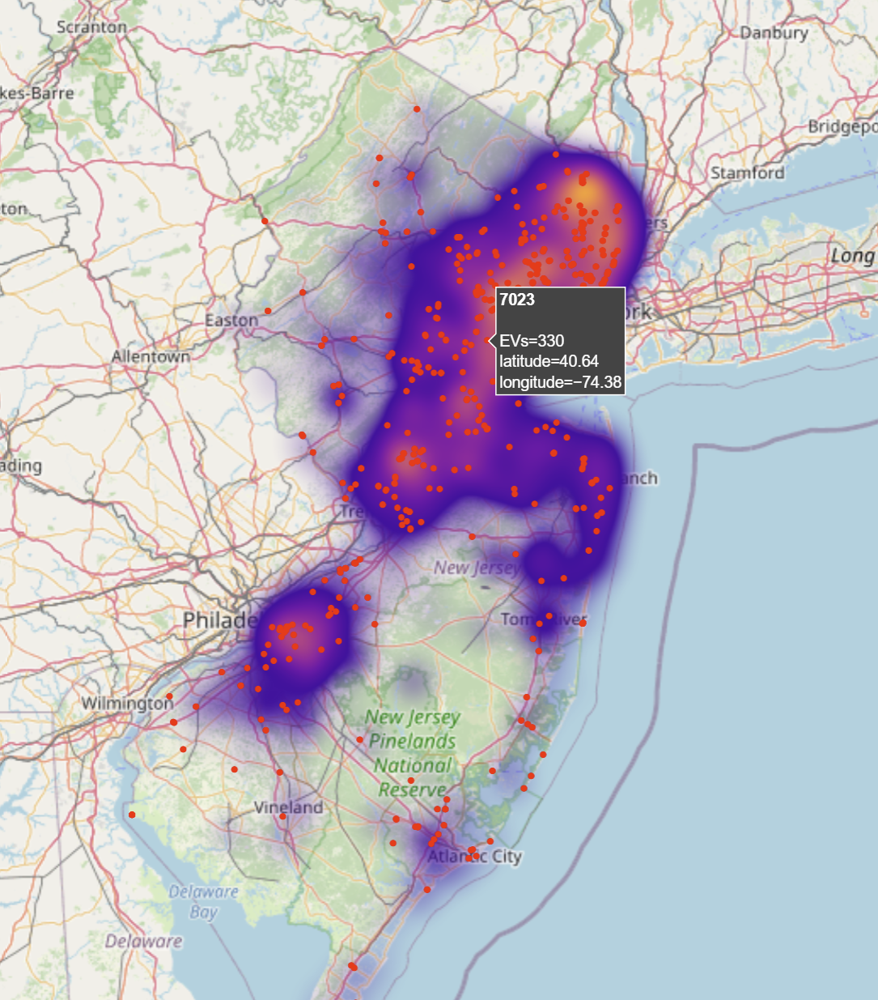

# Python Charging Station Analysis
Using registered vehicle data, zip codes, and charging station location data, I created a python script that displays all electric vehicle charging stations in NJ relative to the registered EV density per zip code. This project was created in Jupyter Notebook.

